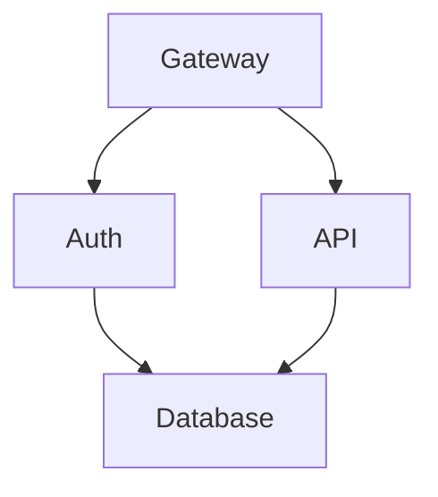

# TermiFlow

> Interactive TUI graph explorer - **jq for diagrams**

Current status: `--print` mode is implemented; TUI navigation is stubbed and will land later. Use `--print` to render to stdout today.

## Features

- **Mermaid-Lite parser** - Supports common flowchart syntax (`graph TD`, nodes, edges)
- **9 border styles** - `ascii`, `unicode`, `double`, `rounded`, `heavy`, `dots`, `plus`, `stars`, `blocks`
- **Composite styling** - Mix and match styles for different components (corners, borders, arrows, edges)
- **Pipe-friendly** - Use `--print` for stdout output, pipe to other tools
- **Cycle detection** - Back-edges rendered in gutter with warnings (or skipped when clipped)
- **Config precedence** - CLI > in-file `%% termiflow:` directive > `~/.config/termiflow/config.toml`

## Installation

```bash
cargo install --path .
```

## Usage

```bash
# Print to stdout (pipe-friendly)
termiflow --print diagram.md

# Read from stdin
cat diagram.md | termiflow --print

# Use Unicode borders
termiflow -s unicode diagram.md

# Strict mode (exit on parse warnings)
termiflow --strict diagram.md

# Interactive mode (not yet implemented - will exit with message)
termiflow diagram.md
```

## CLI Flags

| Flag            | Description                                      | Default |
| --------------- | ------------------------------------------------ | ------- |
| `--print`       | Output to stdout (no TUI)                        | false   |
| `--style`, `-s` | Border style: ascii/unicode/double/rounded/heavy/dots/plus/stars/blocks | unicode |
| `--max-label`   | Max label width before truncation                | 20      |
| `--strict`      | Exit on any parse warning                        | false   |

## Composite Styling

Mix and match styles for different components:

```bash
# Simple style (applies to all components)
echo 'graph TD
%% termiflow: style=unicode
A --> B' | termiflow --print

# Composite style (mix and match)
echo 'graph TD
%% termiflow: style=corner:dots,border:heavy,arrow:unicode,edge:double
A --> B' | termiflow --print
```

**Components:**
- `corner` - Box corners (rounded, dots, stars, plus, etc.)
- `border` - Box borders/lines
- `arrow` - Arrow heads
- `edge` - Connection lines between boxes
- `junction` - T-junctions where edges meet
- `back` - Back edges for cycles

See [COMPOSITE_STYLES.md](./docs/COMPOSITE_STYLES.md) for detailed styling guide.

## Supported Mermaid Syntax



### Supported Patterns

- Direction: `graph TD`, `graph LR`, `graph TB`, `graph BT`
- Nodes: `ID[Label]`, `ID[(Database)]`
- Edges: `A --> B`, `A ---> B`
- Click targets: `click ID "file.md"`
- Config directives: `%% termiflow: key=value`

### Unsupported (v1)

- Edge labels: `A -->|text| B`
- Subgraphs
- Node shapes other than rectangles
- Mermaid styling/classes

## Warnings and limits

- Cycle detection marks back-edges, renders them in a right-hand gutter, and emits a warning. If the canvas is clipped narrower than the gutter, back-edges are skipped with a warning.
- Canvas clipping: graphs wider than 500 cols or taller than 200 rows are clipped with warnings; nodes/edges outside the visible area are skipped.
- Auto-create: references to undefined nodes are auto-created with an informational warning (even in `--strict`).

## Configuration

Config priority: CLI flags > in-file directives > config file

```toml
# ~/.config/termiflow/config.toml
style = "unicode"
max_label_width = 25
```

## Development

```bash
# Build
cargo build

# Test
cargo test

# Run with debug layout (prints coordinates)
cargo run -- --print --debug-layout tests/fixtures/inputs/simple.md
```

## Architecture

See documentation in `docs/` folder:
- [SPEC.md](./docs/SPEC.md) - Current technical specification
- [COMPOSITE_STYLES.md](./docs/COMPOSITE_STYLES.md) - Complete styling system guide
- [PHASE2_PLAN.md](./docs/PHASE2_PLAN.md) - Per-element styling architecture
- [PHASE2_IMPLEMENTATION.md](./docs/PHASE2_IMPLEMENTATION.md) - Implementation details
- [PHASE2_QUICK_REFERENCE.md](./docs/PHASE2_QUICK_REFERENCE.md) - Styling syntax guide

| Module   | Description                                 |
| -------- | ------------------------------------------- |
| `parser` | Two-pass Mermaid-Lite parser with regex     |
| `layout` | Waterfall layout algorithm (toposort + BFS) |
| `canvas` | 2D char grid rendering with edge routing    |
| `style`  | Border styles and unicode-width handling    |
| `config` | Layered configuration loading               |
| `tui`    | (planned) Ratatui-based interactive mode    |

## License

MIT
