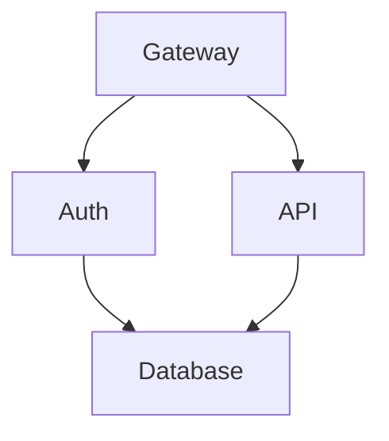

# TermiFlow

> Interactive TUI graph explorer - **jq for diagrams**

Visualize Mermaid flowcharts directly in your terminal with keyboard navigation and drill-down support.

## Features

- **Mermaid-Lite parser** - Supports common flowchart syntax (`graph TD`, nodes, edges)
- **5 border styles** - `ascii`, `unicode`, `double`, `rounded`, `heavy`
- **Pipe-friendly** - Use `--print` for stdout output, pipe to other tools
- **Vim navigation** - `hjkl` movement, `/` search, `Enter` drill-down
- **Cycle detection** - Back-edges rendered in gutter with warnings

## Installation

```bash
cargo install --path .
```

## Usage

```bash
# Interactive TUI mode
termiflow diagram.md

# Print to stdout (pipe-friendly)
termiflow --print diagram.md

# Read from stdin
cat diagram.md | termiflow --print

# Use Unicode borders
termiflow -s unicode diagram.md

# Strict mode (exit on parse warnings)
termiflow --strict diagram.md
```

## CLI Flags

| Flag            | Description                                      | Default |
| --------------- | ------------------------------------------------ | ------- |
| `--print`       | Output to stdout (no TUI)                        | false   |
| `--style`, `-s` | Border style: ascii/unicode/double/rounded/heavy | ascii   |
| `--max-label`   | Max label width before truncation                | 20      |
| `--strict`      | Exit on any parse warning                        | false   |

## Supported Mermaid Syntax



### Supported Patterns

- Direction: `graph TD`, `graph LR`, `graph TB`, `graph BT`
- Nodes: `ID[Label]`, `ID[(Database)]`
- Edges: `A --> B`, `A ---> B`
- Click targets: `click ID "file.md"`
- Config directives: `%% termiflow: key=value`

### Unsupported (v1)

- Edge labels: `A -->|text| B`
- Subgraphs
- Node shapes other than rectangles
- Mermaid styling/classes

## Configuration

Config priority: CLI flags > in-file directives > config file

```toml
# ~/.config/termiflow/config.toml
style = "unicode"
max_label_width = 25
```

## Development

```bash
# Build
cargo build

# Test
cargo test

# Run with debug layout
cargo run -- --print --debug-layout tests/fixtures/inputs/simple.md
```

## Architecture

See [SPEC.md](./docs/SPEC.md) for detailed technical specification.

| Module   | Description                                 |
| -------- | ------------------------------------------- |
| `parser` | Two-pass Mermaid-Lite parser with regex     |
| `layout` | Waterfall layout algorithm (toposort + BFS) |
| `canvas` | 2D char grid rendering with edge routing    |
| `style`  | Border styles and unicode-width handling    |
| `config` | Layered configuration loading               |
| `tui`    | Ratatui-based interactive mode              |

## License

MIT
