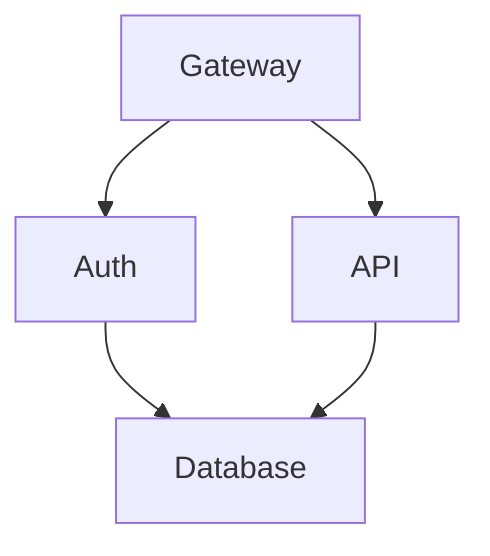

# TermiFlow

> Interactive TUI graph explorer - **jq for diagrams**

Current status: `--print` mode is implemented; TUI navigation is stubbed and will land later. Use `--print` to render to stdout today.

## Features

- **Mermaid-Lite parser** - Supports common flowchart syntax (`graph TD`, nodes, edges) with strict/lenient modes
- **9 border styles** - `ascii`, `unicode`, `double`, `rounded`, `heavy`, `dots`, `plus`, `stars`, `blocks`
- **Composite styling** - Mix and match style components: `corner:dots,border:heavy`
- **Pipe-friendly** - Use `--print` for stdout output, pipe to other tools
- **Cycle detection** - Back-edges rendered in gutter with warnings (or skipped when clipped)
- **Config precedence** - CLI > in-file `%% termiflow:` directive > `~/.config/termiflow/config.toml`

## Installation

```bash
cargo install --path .
```

## Usage

```bash
# Print to stdout (pipe-friendly, unicode is default)
termiflow --print diagram.md

# Read from stdin
cat diagram.md | termiflow --print

# Use a different style
termiflow --print -s heavy diagram.md

# Use composite styling
termiflow --print -s "corner:rounded,border:double" diagram.md

# Strict mode (exit on parse warnings)
termiflow --strict --print diagram.md

# Interactive mode (not yet implemented - will exit with message)
termiflow diagram.md
```

## CLI Flags

| Flag            | Description                                      | Default   |
| --------------- | ------------------------------------------------ | --------- |
| `--print`       | Output to stdout (no TUI)                        | false     |
| `--style`, `-s` | Border style or composite (see below)            | `unicode` |
| `--max-label`   | Max label width before truncation                | 20        |
| `--strict`      | Exit on any parse warning                        | false     |

### Border Styles

Simple styles: `ascii`, `unicode`, `double`, `rounded`, `heavy`, `dots`, `plus`, `stars`, `blocks`

Composite syntax allows mixing components:
```bash
# Mix corner style with border style
termiflow -s "corner:dots,border:heavy" diagram.md

# Available components: corner, border, arrow, edge, junction, back
termiflow -s "corner:rounded,border:double,arrow:unicode" diagram.md
```

## Supported Mermaid Syntax



### Supported Patterns

- Direction: `graph TD`, `graph LR`, `graph TB`, `graph BT`
- Nodes: `ID[Label]`, `ID[(Database)]`
- Edges: `A --> B`, `A ---> B`
- Click targets: `click ID "file.md"`
- Config directives: `%% termiflow: key=value`

### Not Yet Supported

- Edge labels: `A -->|text| B`
- Subgraphs
- Node shapes other than rectangles
- Mermaid styling/classes (`classDef`, `:::`)

## Warnings and limits

- Cycle detection marks back-edges, renders them in a right-hand gutter, and emits a warning. If the canvas is clipped narrower than the gutter, back-edges are skipped with a warning.
- Canvas clipping: graphs wider than 500 cols or taller than 200 rows are clipped with warnings; nodes/edges outside the visible area are skipped.
- Auto-create: references to undefined nodes are auto-created with an informational warning (even in `--strict`).

## Configuration

Config priority: CLI flags > in-file directives > config file

```toml
# ~/.config/termiflow/config.toml
style = "unicode"
max_label_width = 25
```

## Development

```bash
# Build
cargo build

# Test
cargo test

# Run with debug layout (prints coordinates)
cargo run -- --print --debug-layout tests/fixtures/inputs/simple.md
```

## Architecture

User-facing docs live in `docs/`. Planning, specs, and future-phase notes live in `planning/` (including `planning/spec/SPEC.md`).

| Module   | Description                                      |
| -------- | ------------------------------------------------ |
| `parser` | Two-pass Mermaid-Lite parser with regex          |
| `layout` | Waterfall layout algorithm (toposort + BFS)      |
| `canvas` | 2D char grid rendering with edge routing         |
| `style`  | 9 border styles with composite styling system    |
| `config` | Layered configuration loading                    |
| `tui`    | (planned) Ratatui-based interactive mode         |

## License

MIT
