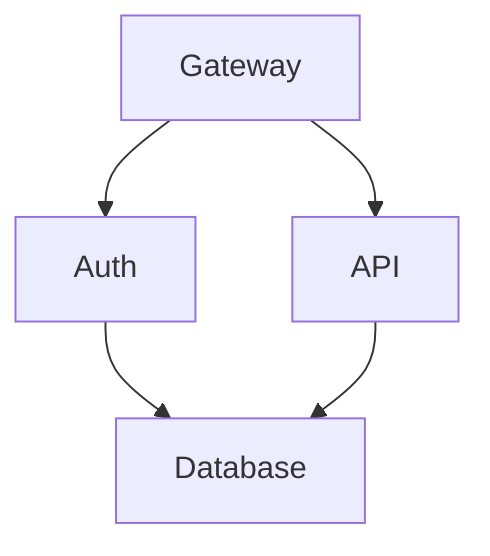
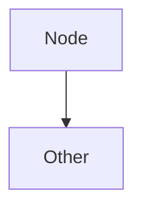

# TermiFlow

> Interactive TUI graph explorer - **jq for diagrams**

Current status: `--print` mode is implemented; TUI navigation is stubbed and will land later. Use `--print` to render to stdout today.

## Features

- **Mermaid-Lite parser** - Supports common flowchart syntax (`graph TD`, nodes, edges) with strict/lenient modes
- **9 border styles** - `ascii`, `unicode`, `double`, `rounded`, `heavy`, `dots`, `plus`, `stars`, `blocks`
- **Composite styling** - Mix and match style components: `corner:dots,border:heavy`
- **9 node shapes** - Rectangle, rounded, diamond, circle, stadium, hexagon, database, subroutine, asymmetric
- **Edge labels** - Pipe syntax `A -->|label| B` and text syntax `A -- label --> B`
- **Pipe-friendly** - Use `--print` for stdout output, pipe to other tools
- **Cycle detection** - Back-edges rendered in gutter with warnings (or skipped when clipped)
- **Config precedence** - CLI > in-file `%% termiflow:` directive > `~/.config/termiflow/config.toml`

## Installation

```bash
cargo install --path .
```

## Usage

```bash
# Print to stdout (pipe-friendly, unicode is default)
termiflow --print diagram.md

# jq-style file flag
termiflow --print -f diagram.md

# Read from stdin
cat diagram.md | termiflow --print

# Use a different style
termiflow --print -s heavy diagram.md

# Use composite styling
termiflow --print -s "corner:rounded,border:double" diagram.md

# Strict mode (exit on parse warnings)
termiflow --strict --print diagram.md

# Interactive mode (not yet implemented - will exit with message)
termiflow diagram.md
```

## CLI Flags

| Flag            | Description                                      | Default   |
| --------------- | ------------------------------------------------ | --------- |
| `--print`       | Output to stdout (no TUI)                        | false     |
| `--file`, `-f`  | Input file (jq-style alias for positional arg)   | -         |
| `--style`, `-s` | Border style or composite (see below)            | `unicode` |
| `--max-label`   | Max label width before truncation                | 20        |
| `--strict`      | Exit on any parse warning                        | false     |

### Border Styles

Simple styles: `ascii`, `unicode`, `double`, `rounded`, `heavy`, `dots`, `plus`, `stars`, `blocks`

Composite syntax allows mixing components:
```bash
# Mix corner style with border style
termiflow -s "corner:dots,border:heavy" diagram.md

# Available components: corner, border, arrow, edge, junction, back
termiflow -s "corner:rounded,border:double,arrow:unicode" diagram.md
```

## Supported Mermaid Syntax



### Supported Patterns

- Direction: `graph TD`, `graph LR`, `graph TB`, `graph BT`
- **Node shapes**:
  - Rectangle: `ID[Label]` (default)
  - Rounded: `ID(Label)`
  - Diamond: `ID{Label}`
  - Circle: `ID((Label))`
  - Stadium: `ID([Label])`
  - Hexagon: `ID{{Label}}`
  - Database: `ID[(Label)]`
  - Subroutine: `ID[[Label]]`
  - Asymmetric: `ID>Label]`
- **Edges**: `A --> B`, `A ---> B`
- **Edge labels**: `A -->|text| B` or `A -- text --> B`
- Click targets: `click ID "file.md"`
- Config directives: `%% termiflow: key=value`
- Diagram type: **flowchart only** (`graph TD/LR/TB/BT`). Other Mermaid diagram types (sequence, class, state, ER, gantt, etc.) are rejected with a clear error.

### Not Yet Supported

- Subgraphs (planned single-level grouping)
- Mermaid styling/classes (`classDef`, `:::`)
- Non-flowchart diagram types (sequence, class, state, ER, gantt, pie, etc.)

### Aliases

- Binary name: `termiflow`
- Recommended short alias: symlink `tw` → `termiflow` (we do **not** ship `tf` to avoid Terraform conflicts)

## Warnings and limits

- Cycle detection marks back-edges, renders them in a right-hand gutter, and emits a warning. If the canvas is clipped narrower than the gutter, back-edges are skipped with a warning.
- Canvas clipping: graphs wider than 500 cols or taller than 200 rows are clipped with warnings; nodes/edges outside the visible area are skipped.
- Auto-create: references to undefined nodes are auto-created with an informational warning (even in `--strict`).

## Configuration

Config priority: CLI flags > in-file directives > config file

### Config File Location (Platform-Specific)

| Platform | Path |
|----------|------|
| macOS    | `~/Library/Application Support/termiflow/config.toml` |
| Linux    | `~/.config/termiflow/config.toml` |
| Windows  | `%APPDATA%\termiflow\config.toml` |

### Config File Format

```toml
# Example config.toml
style = "unicode"           # or composite: "corner:rounded,border:heavy"
max_label_width = 25
```

### In-File Directives

Override config file settings per-diagram:



## Development

```bash
# Build
cargo build

# Test (runs 114 tests: unit, golden, integration, doc)
cargo test

# Run with debug layout (prints coordinates)
cargo run -- --print --debug-layout tests/fixtures/inputs/simple.md
```

### Golden Tests

Golden tests compare actual output against expected files in `tests/fixtures/expected/`.

**Regenerating golden files** (after intentional rendering changes):

```bash
# Regenerate all Unicode golden files
for f in tests/fixtures/inputs/*.md; do
  name=$(basename "$f" .md)
  cargo run --quiet -- --print --style unicode "$f" > "tests/fixtures/expected/${name}.unicode.txt"
done

# Regenerate ASCII variants
cargo run --quiet -- --print --style ascii tests/fixtures/inputs/simple.md > tests/fixtures/expected/simple.ascii.txt
cargo run --quiet -- --print --style ascii tests/fixtures/inputs/chain.md > tests/fixtures/expected/chain.ascii.txt
```

**Adding new fixtures:**
1. Create `tests/fixtures/inputs/new_case.md`
2. Generate expected output: `cargo run --quiet -- --print tests/fixtures/inputs/new_case.md > tests/fixtures/expected/new_case.unicode.txt`
3. Add test to `tests/golden.rs`

## Architecture

User-facing docs live in `docs/`. Planning, specs, and future-phase notes live in `planning/` (including `planning/spec/SPEC.md`).

| Module        | Description                                      |
| ------------- | ------------------------------------------------ |
| `parser`      | Two-pass Mermaid-Lite parser with regex          |
| `layout`      | Waterfall layout algorithm (toposort + BFS)      |
| `render/`     | Render orchestration and drawing                 |
| ├─ `edge`     | Direction-agnostic edge routing (all 4 dirs)     |
| ├─ `cycle`    | Cycle edge routing through gutters               |
| ├─ `shapes`   | Box drawing for 9 node shapes                    |
| └─ `canvas`   | 2D char grid with overlap resolution             |
| `orientation` | Direction abstraction (OrientedCoords)           |
| `style`       | 9 border styles with composite styling system    |
| `config`      | Layered configuration loading                    |
| `tui`         | (planned) Ratatui-based interactive mode         |

### Render Pipeline

```
┌─────────────────────────────────────────────────────────────────────────────┐
│                          RENDER PIPELINE                                    │
└─────────────────────────────────────────────────────────────────────────────┘

                              ┌──────────────┐
                              │   render()   │
                              │   mod.rs     │
                              └──────┬───────┘
                                     │
        ┌────────────────────────────┼────────────────────────────┐
        │  PHASE 1: SETUP            ▼                            │
        │  ┌────────────────────────────────────────────────┐     │
        │  │  • Calculate canvas dimensions                 │     │
        │  │  • Add CYCLE_GUTTER if graph has cycles        │     │
        │  │  • Create Canvas                               │     │
        │  └────────────────────────────────────────────────┘     │
        └────────────────────────────┼────────────────────────────┘
                                     │
        ┌────────────────────────────┼────────────────────────────┐
        │  PHASE 2: CLASSIFY         ▼                            │
        │  ┌────────────────────────────────────────────────┐     │
        │  │  Partition edges:                              │     │
        │  │  • edges_by_source  { "A": [B, C] }           │     │
        │  │  • edges_by_target  { "D": [A, B] }           │     │
        │  │  • cycle_edges      [(X, Y), ...]             │     │
        │  └────────────────────────────────────────────────┘     │
        └────────────────────────────┼────────────────────────────┘
                                     │
        ┌────────────────────────────┼────────────────────────────┐
        │  PHASE 3: ROUTE EDGES      ▼  (draw BEFORE boxes)       │
        │  ┌────────────────────────────────────────────────┐     │
        │  │  1. route_convergent_edges()   N → 1           │     │
        │  │     A ──┐                                      │     │
        │  │     B ──┼──→ D                                 │     │
        │  │     C ──┘                                      │     │
        │  │                                                │     │
        │  │  2. route_divergent_edges()    1 → N           │     │
        │  │          ┌──→ B                                │     │
        │  │     A ───┼──→ C                                │     │
        │  │          └──→ D                                │     │
        │  │                                                │     │
        │  │  3. route_cycle_edge()         via gutter      │     │
        │  │     ┌───┐       ┌───┐                          │     │
        │  │     │ A │ ←╌╌╌╌ │ B │                          │     │
        │  │     └───┘   ╎   └───┘                          │     │
        │  │             ╰╌╌╌╌╌╌╌╯                          │     │
        │  └────────────────────────────────────────────────┘     │
        └────────────────────────────┼────────────────────────────┘
                                     │
        ┌────────────────────────────┼────────────────────────────┐
        │  PHASE 4: DRAW             ▼                            │
        │  ┌────────────────────────────────────────────────┐     │
        │  │  1. draw_edge_label()   on edge segments       │     │
        │  │  2. shapes::draw_node() boxes OVERWRITE edges  │     │
        │  │                                                │     │
        │  │     ┌───────┐  (───────)  ◇───────◇  ((───))   │     │
        │  │     │ rect  │  ( round )  ◇ diamond  (circle)  │     │
        │  │     └───────┘  (───────)  ◇───────◇  ((───))   │     │
        │  └────────────────────────────────────────────────┘     │
        └────────────────────────────┼────────────────────────────┘
                                     │
                                     ▼
                          ┌──────────────────┐
                          │ canvas.to_string │
                          │    → stdout      │
                          └──────────────────┘
```

### Direction Abstraction

`OrientedCoords` enables a **single algorithm** for all 4 directions:

```
  TD (Top→Down)      LR (Left→Right)     BT (Bottom→Top)     RL (Right→Left)

      A                  A ───→ B              B                  B ←─── A
      │                                        │
      ▼                                        ▼
      B                                        A

  Primary: Y (↓)      Primary: X (→)      Primary: Y (↑)      Primary: X (←)
  Secondary: X        Secondary: Y        Secondary: X        Secondary: Y
```

Key methods:
- `advance(x, y, dist)` — Move in flow direction
- `retreat(x, y, dist)` — Move against flow
- `with_secondary(x, y, val)` — Position on branching axis

## License

MIT
