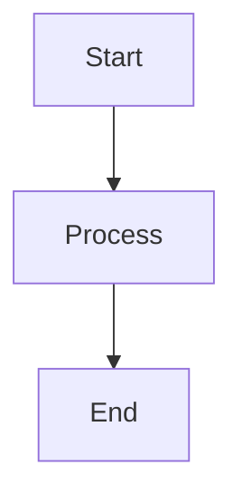
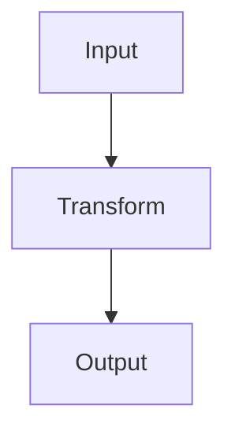
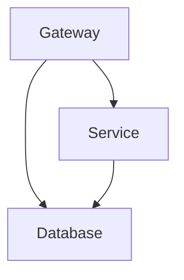

# TermiFlow Composite Styles Guide

## Overview

TermiFlow's composite styling system allows independent styling of different diagram components. Each component can use any of the available BorderStyle variants.

## Component Names (Clear & Concise)

| Component | Description | Example Characters |
|-----------|-------------|-------------------|
| **`corner`** | Box corners | `┌┐└┘` `╭╮╰╯` `╔╗╚╝` `••••` `****` `++++` |
| **`border`** | Box borders (h/v lines) | `─│` `═║` `━┃` `███` |
| **`arrow`** | Arrow heads | `▼◀▶` `v<>` |
| **`edge`** | Connection lines | `─│` `═║` `━┃` |
| **`junction`** | T-junctions | `┬┴├┤` `╦╩╠╣` `┳┻┣┫` |
| **`back`** | Back edges (cycles) | Uses same chars as main style |

## Available Styles

Each component can use any of these styles:

- **`ascii`** - Basic ASCII characters (`+-|`)
- **`unicode`** - Standard box drawing (`┌─┐│`)
- **`double`** - Double lines (`╔═╗║`)
- **`rounded`** - Rounded corners (`╭─╮│`)
- **`heavy`** - Bold lines (`┏━┓┃`)
- **`dots`** - Bullet corners (`•`)
- **`plus`** - Plus corners (`+`)
- **`stars`** - Star corners (`*`)
- **`blocks`** - Solid blocks (`█`)

## Syntax

### Simple Style (applies to all components)
```
%% termiflow: style=unicode
```

### Composite Style (mix and match)
```
%% termiflow: style=corner:rounded,border:heavy,arrow:unicode,edge:double
```

### Component-Specific Examples

#### Fancy Corners with Regular Borders
```
%% termiflow: style=corner:dots,border:unicode
```
```
• ─────── •
│  Node   │
• ─────── •
```

#### Rounded Corners with Heavy Borders
```
%% termiflow: style=corner:rounded,border:heavy
```
```
╭━━━━━━━━━╮
┃  Node   ┃
╰━━━━━━━━━╯
```

#### Stars and Double Lines
```
%% termiflow: style=corner:stars,border:double
```
```
* ═══════ *
║  Node   ║
* ═══════ *
```

## Complete Examples

### Example 1: Professional Look


### Example 2: Bold and Heavy


### Example 3: Creative Mix


## Legacy Compatibility

The following legacy names are still supported for backward compatibility:

- `box` → sets both `corner` and `border`
- `line` → maps to `edge`
- `box_corner` → maps to `corner`
- `box_line` or `box_border` → maps to `border`
- `back_edge` → maps to `back`

## Default Behavior

- If no style is specified, Unicode is used as the default
- Simple style names (e.g., `style=rounded`) apply to all components
- Component-specific styles override the simple style

## Tips

1. **Keep it Simple**: Often a simple style like `style=unicode` or `style=rounded` is all you need
2. **Mix Carefully**: Not all combinations look good - test your choices
3. **Consider Context**: ASCII style is best for maximum compatibility
4. **Be Consistent**: Use similar styles across your documentation

## Full Component Reference

### Corner Styles
- `corner:ascii` → `+`
- `corner:unicode` → `┌┐└┘`
- `corner:double` → `╔╗╚╝`
- `corner:rounded` → `╭╮╰╯`
- `corner:heavy` → `┏┓┗┛`
- `corner:dots` → `•`
- `corner:plus` → `+`
- `corner:stars` → `*`
- `corner:blocks` → `█`

### Border Styles
- `border:ascii` → `-|`
- `border:unicode` → `─│`
- `border:double` → `═║`
- `border:rounded` → `─│` (same as unicode)
- `border:heavy` → `━┃`
- `border:blocks` → `██`

### Arrow Styles
- `arrow:ascii` → `v^<>`
- `arrow:unicode` → `▼▲◀▶`
- `arrow:double` → `▼▲◀▶` (same as unicode)
- `arrow:heavy` → `▼▲◀▶` (same as unicode)

### Edge Styles
- `edge:ascii` → `-|`
- `edge:unicode` → `─│`
- `edge:double` → `═║`
- `edge:heavy` → `━┃`

### Junction Styles
- `junction:ascii` → `+`
- `junction:unicode` → `┬┴├┤`
- `junction:double` → `╦╩╠╣`
- `junction:heavy` → `┳┻┣┫`

### Back Edge Styles
- `back:ascii` → `-:`
- `back:unicode` → `┄┆`
- `back:double` → `┄┊`
- `back:heavy` → `┅╏`