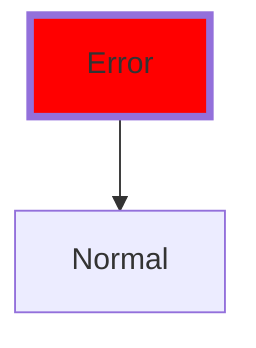
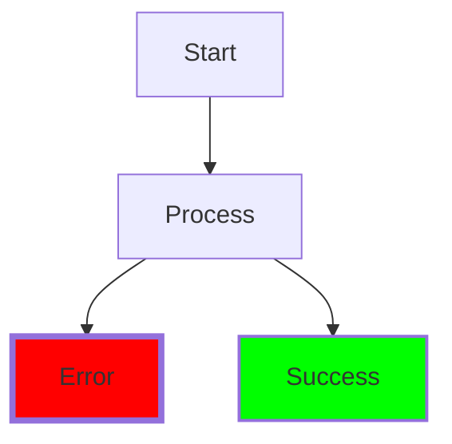
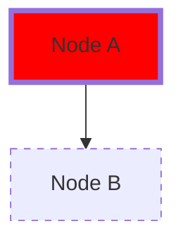
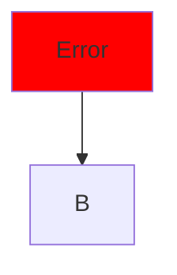

# Phase 2 Implementation: Mermaid-Compatible Styling

## 🎯 Core Principle

**Every diagram must render correctly in standard Mermaid tools.** We only enhance terminal rendering.

## Parser Additions

### New Regex Patterns

```rust
// Mermaid class definition
// classDef critical fill:#ff6b6b,stroke:#333,stroke-width:4px
static ref RE_CLASSDEF: Regex = Regex::new(
    r"classDef\s+(\w+)\s+((?:\w+:[^,\s]+,?)+)"
).unwrap();

// Mermaid style statement  
// style A fill:#f9f,stroke:#333
static ref RE_STYLE: Regex = Regex::new(
    r"style\s+(\w+)\s+((?:\w+:[^,\s]+,?)+)"
).unwrap();

// Mermaid class application
// class A,B critical
static ref RE_CLASS: Regex = Regex::new(
    r"class\s+([\w,]+)\s+(\w+)"
).unwrap();

// Node with class (already supported in our parser!)
// A[Label]:::className
static ref RE_NODE_CLASS: Regex = Regex::new(
    r"([a-zA-Z0-9_]+)\[([^\]]*)\]:::(\w+)"
).unwrap();

// TermiFlow style hints in comments
// %% termiflow-style: critical border=heavy color=red
static ref RE_TERMIFLOW_STYLE: Regex = Regex::new(
    r"%%\s*termiflow-style:\s*(\w+)\s+(.*)"
).unwrap();
```

### Style Property Parsing

```rust
#[derive(Debug, Clone)]
pub struct MermaidStyle {
    pub fill: Option<String>,         // Background color
    pub stroke: Option<String>,       // Border color  
    pub stroke_width: Option<f32>,    // Border thickness
    pub stroke_dasharray: Option<String>, // Dashed pattern
    pub color: Option<String>,        // Text color
    pub rx: Option<f32>,             // Border radius X
    pub ry: Option<f32>,             // Border radius Y
}

impl MermaidStyle {
    fn parse(props: &str) -> Self {
        let mut style = MermaidStyle::default();
        
        for prop in props.split(',') {
            if let Some((key, value)) = prop.split_once(':') {
                match key.trim() {
                    "fill" => style.fill = Some(value.trim().to_string()),
                    "stroke" => style.stroke = Some(value.trim().to_string()),
                    "stroke-width" => {
                        if let Ok(w) = value.trim_end_matches("px").parse() {
                            style.stroke_width = Some(w);
                        }
                    }
                    "stroke-dasharray" => style.stroke_dasharray = Some(value.trim().to_string()),
                    "color" => style.color = Some(value.trim().to_string()),
                    "rx" => { if let Ok(r) = value.parse() { style.rx = Some(r); }},
                    "ry" => { if let Ok(r) = value.parse() { style.ry = Some(r); }},
                    _ => {} // Ignore unknown properties
                }
            }
        }
        
        style
    }
}
```

### Terminal Style Mapping

```rust
#[derive(Debug, Clone)]
pub struct TerminalNodeStyle {
    pub border: BorderStyle,
    pub color: Option<ANSIColor>,
    pub bg_pattern: Option<BgPattern>,
}

impl From<&MermaidStyle> for TerminalNodeStyle {
    fn from(mermaid: &MermaidStyle) -> Self {
        TerminalNodeStyle {
            border: map_border_style(mermaid),
            color: map_color(&mermaid.stroke),
            bg_pattern: None, // Future: map fill to patterns
        }
    }
}

fn map_border_style(style: &MermaidStyle) -> BorderStyle {
    // Map stroke-width to border style
    match style.stroke_width {
        Some(w) if w >= 4.0 => BorderStyle::Heavy,
        Some(w) if w >= 2.0 => BorderStyle::Double,
        _ => {
            // Check for rounded corners
            if style.rx.is_some() || style.ry.is_some() {
                BorderStyle::Rounded
            } else if style.stroke_dasharray.is_some() {
                BorderStyle::Ascii // TODO: Add dashed variant
            } else {
                BorderStyle::Unicode
            }
        }
    }
}

fn map_color(hex: &Option<String>) -> Option<ANSIColor> {
    hex.as_ref().and_then(|h| {
        // Map hex colors to nearest ANSI color
        match h.as_str() {
            "#ff0000" | "#ff6b6b" | "#d63031" => Some(ANSIColor::Red),
            "#00ff00" | "#55efc4" | "#00b894" => Some(ANSIColor::Green),
            "#0000ff" | "#74b9ff" | "#0984e3" => Some(ANSIColor::Blue),
            "#ffff00" | "#ffeaa7" | "#fdcb6e" => Some(ANSIColor::Yellow),
            "#ff00ff" | "#fd79a8" | "#e84393" => Some(ANSIColor::Magenta),
            "#00ffff" | "#81ecec" | "#00cec9" => Some(ANSIColor::Cyan),
            _ => None
        }
    })
}
```

## Parse Flow Integration

### Pass 1 Enhancement: Collect Styles

```rust
struct ParseContext {
    // Existing
    known_ids: HashSet<String>,
    node_labels: HashMap<String, String>,
    
    // NEW for Phase 2
    class_definitions: HashMap<String, MermaidStyle>,
    node_styles: HashMap<String, MermaidStyle>,
    node_classes: HashMap<String, String>,
    termiflow_hints: HashMap<String, TerminalHints>,
}

// In Pass 1
for line in lines {
    // Parse class definitions
    if let Some(caps) = RE_CLASSDEF.captures(line) {
        let class_name = caps[1].to_string();
        let style = MermaidStyle::parse(&caps[2]);
        context.class_definitions.insert(class_name, style);
    }
    
    // Parse style statements
    if let Some(caps) = RE_STYLE.captures(line) {
        let node_id = caps[1].to_string();
        let style = MermaidStyle::parse(&caps[2]);
        context.node_styles.insert(node_id, style);
    }
    
    // Parse class applications
    if let Some(caps) = RE_CLASS.captures(line) {
        let node_ids = caps[1].split(',');
        let class_name = caps[2].to_string();
        for id in node_ids {
            context.node_classes.insert(id.trim().to_string(), class_name.clone());
        }
    }
    
    // Parse nodes with classes
    if let Some(caps) = RE_NODE_CLASS.captures(line) {
        let node_id = caps[1].to_string();
        let label = caps[2].to_string();
        let class_name = caps[3].to_string();
        
        context.node_labels.insert(node_id.clone(), label);
        context.node_classes.insert(node_id, class_name);
    }
}
```

### Pass 2 Enhancement: Apply Styles

```rust
// When creating nodes
for id in &known_ids {
    let mut node = Node {
        id: id.clone(),
        label: node_labels.get(id).cloned().unwrap_or(id.clone()),
        // ... existing fields
    };
    
    // NEW: Resolve and apply styles
    let resolved_style = resolve_node_style(id, &context);
    node.terminal_style = resolved_style.map(|s| s.into());
    
    graph.nodes.push(node);
}

fn resolve_node_style(
    node_id: &str, 
    context: &ParseContext
) -> Option<MermaidStyle> {
    // Priority: direct style > class > none
    
    // Check for direct style
    if let Some(style) = context.node_styles.get(node_id) {
        return Some(style.clone());
    }
    
    // Check for class
    if let Some(class_name) = context.node_classes.get(node_id) {
        if let Some(style) = context.class_definitions.get(class_name) {
            return Some(style.clone());
        }
    }
    
    None
}
```

## Canvas Rendering Updates

```rust
impl Canvas {
    pub fn render_with_styles(graph: &Graph, global_style: &BorderStyle) -> Result<String> {
        let mut canvas = Canvas::new(width, height);
        
        // Draw nodes with individual styles
        for node in &graph.nodes {
            let style = node.terminal_style
                .as_ref()
                .map(|ts| &ts.border)
                .unwrap_or(global_style);
            
            let chars = style.chars();
            draw_box(&mut canvas, node.x, node.y, node.width, &node.label, chars);
            
            // If color is specified, wrap in ANSI codes
            if let Some(ref ts) = node.terminal_style {
                if let Some(color) = &ts.color {
                    apply_color_to_region(&mut canvas, node.x, node.y, node.width, BOX_HEIGHT, color);
                }
            }
        }
        
        Ok(canvas.to_string())
    }
}

fn apply_color_to_region(
    canvas: &mut Canvas, 
    x: usize, y: usize, 
    width: usize, height: usize,
    color: &ANSIColor
) {
    // This is complex - might need to track color regions
    // and emit ANSI codes during to_string()
    // For Phase 2.1, maybe just color the box borders
}
```

## Example Test Cases

### Test 1: Basic Class Definition



**Expected Terminal Output:**
- A rendered with heavy borders (from stroke-width:4px)
- B rendered with normal borders

### Test 2: Multiple Classes



**Expected Terminal Output:**
- A, B with normal borders
- C with heavy borders
- D with double borders

### Test 3: Direct Styling



**Expected Terminal Output:**
- A with heavy borders
- B with normal borders (dashed not supported in Phase 2.1)

### Test 4: Combined with TermiFlow Hints



**Expected Terminal Output:**
- A with heavy borders
- Future: A could blink if terminal supports it

## Migration Path

### Phase 2.1: Foundation (Current)
- Parse `classDef` statements
- Parse `style` statements
- Parse `:::className` on nodes
- Map stroke-width to border styles
- Apply to nodes during rendering

### Phase 2.2: Colors (Next)
- Parse color properties
- Add ANSI color codes
- Handle terminal capability detection

### Phase 2.3: Advanced (Future)
- Edge styling (via comments only)
- Background patterns
- Animation (blink, etc.)
- True color support

## Compatibility Matrix

| Feature | Mermaid | GitHub | TermiFlow |
|---------|---------|--------|-----------|
| `classDef` | ✅ | ✅ | ✅ Parse & map |
| `style` | ✅ | ✅ | ✅ Parse & map |
| `:::class` | ✅ | ✅ | ✅ Parse & apply |
| `class` statement | ✅ | ✅ | ✅ Parse & apply |
| Node colors | ✅ | ✅ | 🔨 Phase 2.2 |
| Edge styling | ❌ | ❌ | 🔨 Via comments |
| Animation | ❌ | ❌ | 🔨 Phase 2.3 |

## Success Criteria

1. **Zero Breaking Changes**: All existing diagrams work
2. **Mermaid Compatible**: Styled diagrams render in Mermaid.live
3. **Progressive Enhancement**: Graceful degradation
4. **Performance**: <10% overhead with styles
5. **Intuitive**: Mermaid users can immediately use it