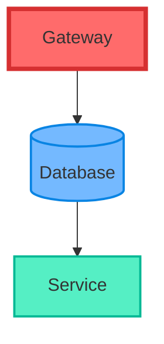
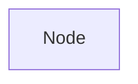
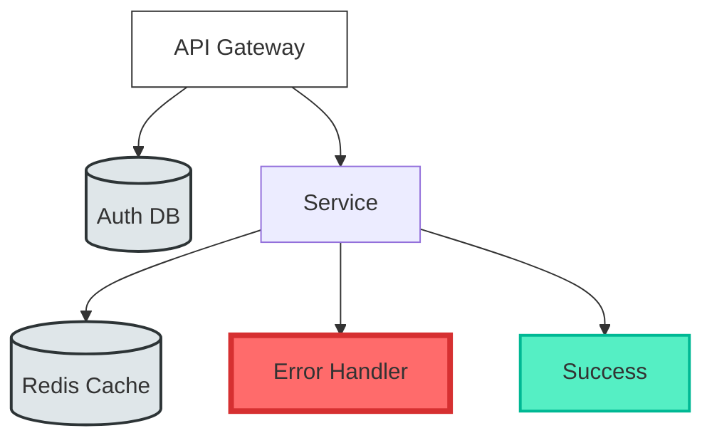

# TermiFlow Phase 2: Per-Element Styling Architecture

## Executive Summary

Enable individual styling for nodes and edges while maintaining backward compatibility and performance. This allows visual differentiation of node types, states, and relationships.

## 🎯 Strategic Goals

1. **Visual Semantics**: Different styles convey meaning (error states, node types, critical paths)
2. **Flexibility**: Support both inline and class-based styling
3. **Performance**: Minimal overhead for unstyled elements
4. **Compatibility**: Gracefully degrade, preserve Phase 1 behavior

## 📊 Use Cases

### Primary Use Cases
- **Node Types**: Database nodes with double borders, services with rounded
- **State Visualization**: Error nodes in heavy/red, success in green
- **System Boundaries**: Microservices A in unicode, B in double
- **Critical Paths**: Highlight important flows with bold/colored edges
- **Visual Grouping**: Style-based grouping without subgraphs

### Example Scenarios

```mermaid
graph TD
    Gateway[API Gateway]:::heavy
    Auth[(Auth DB)]:::double
    Service[Microservice]:::unicode
    Cache[(Redis)]:::rounded
    
    Gateway -->|critical|:::bold Auth
    Gateway --> Service
    Service -->|cached|:::dashed Cache
```

## 🏗️ Architecture Design

### ⚠️ Critical Constraint: 100% Mermaid Compatibility

**Any syntax we use MUST render correctly in standard Mermaid viewers** (GitHub, Mermaid.live, etc.)

This means:
- NO custom syntax in nodes/edges
- NO breaking changes to Mermaid syntax
- ONLY use existing Mermaid features or comments

### Solution: Pure Mermaid Style Syntax (Recommended) ⭐

Use Mermaid's native styling system and map to terminal styles:



**This approach:**
✅ Works perfectly in GitHub/Mermaid.live  
✅ Uses standard Mermaid syntax
✅ Allows terminal-specific hints in comments
✅ Gracefully degrades

### Style Mapping Strategy

Map Mermaid styles to terminal styles:

| Mermaid Style | Terminal Equivalent |
|--------------|-------------------|
| `stroke-width:4px` | `heavy` border |
| `stroke-width:2px` | `double` border |
| `stroke-dasharray` | `dashed` line |
| `fill:#ff6b6b` | Red background (if supported) |
| `stroke:#d63031` | Red border color |
| `rx:5` | `rounded` border |

### Mermaid Style Properties We Parse

```mermaid
classDef className fill:#hex,stroke:#hex,stroke-width:Npx,color:#hex,stroke-dasharray:N,rx:N,ry:N

style nodeId fill:#hex,stroke:#hex,stroke-width:Npx

class nodeId className
```

### Comment-Based Extensions (Optional)

For features Mermaid doesn't support:



### Example: Real-World Usage



**In Mermaid Viewer**: Shows colored boxes with different strokes
**In TermiFlow**: Shows terminal-styled boxes with appropriate borders

## 📐 Data Structure Changes

### Current Structure
```rust
pub struct Node {
    pub id: String,
    pub label: String,
    pub click_target: Option<String>,
    // ... positioning fields
}

pub struct Edge {
    pub from: String,
    pub to: String,
    pub is_back_edge: bool,
}
```

### Phase 2 Structure
```rust
pub struct Node {
    pub id: String,
    pub label: String,
    pub click_target: Option<String>,
    pub style_overrides: Option<NodeStyle>, // NEW
    pub style_classes: Vec<String>,         // NEW
    // ... positioning fields
}

pub struct NodeStyle {
    pub border: Option<BorderStyle>,
    pub text_color: Option<Color>,
    pub bg_pattern: Option<BgPattern>,
    pub width_override: Option<usize>,
}

pub struct Edge {
    pub from: String,
    pub to: String,
    pub label: Option<String>,              // NEW (Phase 2.5)
    pub is_back_edge: bool,
    pub style_overrides: Option<EdgeStyle>, // NEW
    pub style_classes: Vec<String>,         // NEW
}

pub struct EdgeStyle {
    pub line_style: Option<LineStyle>,
    pub arrow_style: Option<ArrowStyle>,
    pub color: Option<Color>,
}

pub enum LineStyle {
    Solid,
    Dashed,
    Dotted,
    Double,
    Heavy,
}

pub enum ArrowStyle {
    Normal,
    Double,
    None,
    Circle,
}

pub enum Color {
    Default,
    Red,
    Green,
    Blue,
    Yellow,
    Cyan,
    Magenta,
    Gray,
    BrightRed,
    // ... ANSI colors
}
```

### Style Resolution Pipeline

```
1. Start with global style (from CLI/config)
2. Apply style class if specified
3. Apply inline overrides
4. Cache resolved style for rendering
```

## 🔧 Implementation Plan

### Phase 2.1: Foundation (Week 1)
- [ ] Add style fields to Node and Edge structs
- [ ] Create NodeStyle and EdgeStyle types
- [ ] Implement style resolution logic
- [ ] Update tests for new structures

### Phase 2.2: Parser Support (Week 1-2)
- [ ] Parse `:::className` syntax
- [ ] Parse inline `{style:value}` syntax
- [ ] Parse `classDef` statements
- [ ] Parse TermiFlow style directives
- [ ] Handle style inheritance

### Phase 2.3: Rendering Engine (Week 2)
- [ ] Refactor canvas to accept per-element styles
- [ ] Implement style switching during render
- [ ] Add ANSI color support
- [ ] Handle style transitions at junctions

### Phase 2.4: Advanced Features (Week 3)
- [ ] Background patterns (···, ///,  ███)
- [ ] Text styling (bold, italic via ANSI)
- [ ] Custom arrow heads
- [ ] Gradient effects (if terminal supports)

### Phase 2.5: Edge Labels & Annotations (Week 3-4)
- [ ] Parse edge labels
- [ ] Position edge labels
- [ ] Style edge labels independently
- [ ] Add node annotations/badges

## 🎨 Rendering Considerations

### Multi-Style Canvas Rendering

```rust
impl Canvas {
    pub fn draw_box_styled(&mut self, x: usize, y: usize, width: usize, 
                          label: &str, style: &ResolvedNodeStyle) {
        let chars = style.border_style.chars();
        let color_start = style.color.ansi_code();
        let color_end = "\x1b[0m";
        // Draw with ANSI codes
    }
    
    pub fn draw_edge_styled(&mut self, from: &Node, to: &Node, 
                          edge_style: &ResolvedEdgeStyle) {
        // Switch styles per edge
    }
}
```

### Junction Handling with Mixed Styles

When different styled edges meet:
1. Use style priority (heavy > double > normal)
2. Create special junction characters
3. Fallback to cross character

### Terminal Capabilities

```rust
pub struct TerminalCaps {
    pub colors_256: bool,
    pub true_color: bool,
    pub unicode: bool,
}

impl TerminalCaps {
    pub fn detect() -> Self {
        // Check TERM, COLORTERM env vars
        // Graceful degradation
    }
}
```

## 📋 Migration Strategy

### Backward Compatibility
1. All Phase 1 diagrams work unchanged
2. Global style still applies to unstyled elements
3. New syntax ignored in strict mode (warning)

### Gradual Adoption Path
```
Level 0: Current (global style only)
Level 1: Style classes (classDef + :::)
Level 2: Inline overrides ({style:})
Level 3: Full per-element control
```

### Configuration
```toml
# ~/.config/termiflow/config.toml
[styles]
enable_per_element = true
color_mode = "256"  # none|16|256|true

[style_classes]
critical = { border = "heavy", color = "red" }
database = { border = "double" }
external = { border = "dashed", color = "gray" }
```

## 🔬 Performance Considerations

### Memory Impact
- ~48 bytes per node for style fields (Option+Vec)
- ~40 bytes per edge for style fields
- Negligible for <1000 nodes

### Rendering Performance
- Style resolution cached after first pass
- ANSI codes add ~10 bytes per style change
- Batch style changes to minimize output

### Optimization Strategies
1. Lazy style resolution
2. Style deduplication (intern common styles)
3. Render-time style merging
4. Skip ANSI codes if not supported

## 🧪 Testing Strategy

### Unit Tests
- Style parsing
- Style resolution precedence  
- Style merging logic
- ANSI code generation

### Integration Tests
- Multi-style diagrams
- Style inheritance
- Junction rendering
- Terminal capability detection

### Visual Tests
- Screenshot comparison
- Cross-platform rendering
- Color accuracy

## 📚 Documentation Updates

### User Guide Additions
- Style syntax guide
- Common style patterns
- Color palette reference
- Terminal setup guide

### API Documentation
- New struct fields
- Style resolution algorithm
- Rendering pipeline changes

## 🚀 Future Possibilities (Phase 3+)

### Advanced Styling
- Animated styles (blinking, pulsing)
- Icon support (Nerd Fonts)
- Multi-line node labels with formatting
- Shadow effects

### Interactive Features
- Style-based filtering
- Dynamic style changes
- Style themes/presets
- Export with styles (SVG)

### Integration
- CSS-like style sheets
- Import styles from external files
- VSCode extension for previews
- Style validation/linting

## 📈 Success Metrics

1. **Adoption**: >50% of power users use per-element styles
2. **Performance**: <5% rendering overhead with styles
3. **Compatibility**: 100% backward compatibility
4. **Usability**: Intuitive syntax (user survey >4/5)

## 🎯 Decision Points

### Immediate Decisions Needed
1. **Syntax Choice**: Hybrid (A), Pure Directive (B), or Extended (C)?
2. **Color Support**: None, 16, 256, or true color?
3. **Phase 2.1 Scope**: Just structure, or include basic parsing?

### Deferred Decisions
1. Edge labels (Phase 2.5)
2. Animation support (Phase 3)
3. Icon integration (Phase 3)

## 📅 Proposed Timeline

```
Week 1: Foundation + Basic Parser
Week 2: Full Parser + Rendering
Week 3: Colors + Advanced Features
Week 4: Testing + Documentation
```

## ✅ Recommendation

**Start with Option A (Hybrid Syntax)** because it:
1. Provides easiest migration path
2. Partially compatible with Mermaid
3. Extensible for future needs
4. Clear separation of concerns

**Initial Focus**:
1. Border styles per node
2. Line styles per edge  
3. Basic 16-color support
4. Style classes only (defer inline)

This provides immediate value while keeping complexity manageable.