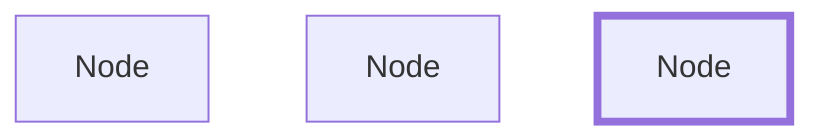
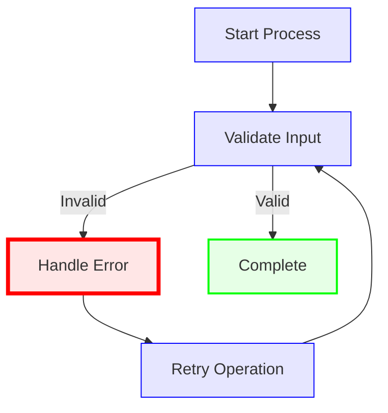
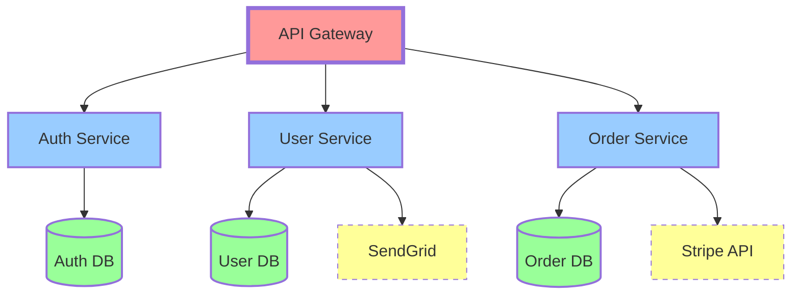
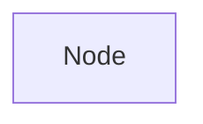
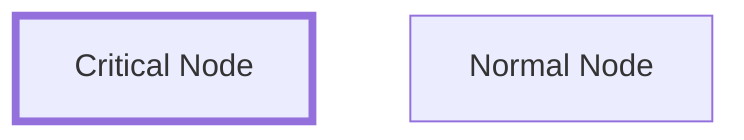
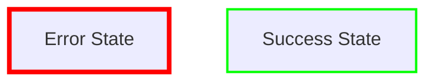

# TermiFlow Phase 2: Styling Quick Reference

## 🎯 Golden Rule

**Your diagram MUST work in GitHub/Mermaid.live unchanged.**

## ✅ Supported Mermaid Styling (Phase 2.1)

### Class Definitions

```mermaid
classDef className property:value,property:value
```

| Property | Terminal Mapping | Example |
|----------|-----------------|---------|
| `stroke-width:4px+` | Heavy border `┏━┓` | `classDef critical stroke-width:4px` |
| `stroke-width:2-3px` | Double border `╔═╗` | `classDef important stroke-width:2px` |
| `stroke-width:1px` | Normal border `┌─┐` | `classDef normal stroke-width:1px` |
| `rx:5,ry:5` | Rounded border `╭─╮` | `classDef soft rx:5` |
| `stroke-dasharray:5` | ASCII border `+-+` | `classDef draft stroke-dasharray:5` |

### Applying Styles to Nodes



## 🎨 Complete Examples

### Example 1: Error Handling Flow



**Terminal Output (Phase 2.1):**
```
┌───────────────┐
│ Start Process │  (normal border)
└───────────────┘
        │
        ▼
┌────────────────┐
│ Validate Input │  (normal border)
└────────────────┘
     │        │
  Invalid   Valid
     ▼        ▼
┏━━━━━━━━━━━━━┓  ╔═══════════╗
┃ Handle Error ┃  ║ Complete  ║
┗━━━━━━━━━━━━━┛  ╚═══════════╝
     (heavy)        (double)
```

### Example 2: Microservices Architecture



**Terminal Output (Phase 2.1):**
- Gateway: Heavy border `┏━┓`
- Services: Double border `╔═╗`
- Databases: Rounded border `╭─╮`
- External: ASCII border `+-+`

## 🔮 Future Enhancements (Phase 2.2+)

### Color Support (Phase 2.2)

```mermaid
classDef red stroke:#ff0000,fill:#ffe6e6
classDef green stroke:#00ff00,fill:#e6ffe6
classDef blue stroke:#0000ff,fill:#e6e6ff
```

Terminal with ANSI colors:
- Red: `\033[31m┌─┐\033[0m`
- Green: `\033[32m┌─┐\033[0m`
- Blue: `\033[34m┌─┐\033[0m`

### Terminal-Only Hints (Phase 2.3)



## 📋 Mermaid Compatibility Checklist

Before using any style syntax, verify:

- [ ] Works in [Mermaid Live Editor](https://mermaid.live)
- [ ] Renders in GitHub README
- [ ] No syntax errors in VSCode Mermaid preview
- [ ] Graceful degradation (styles ignored if not supported)

## 🚫 What NOT to Do

### ❌ Don't Break Mermaid Syntax

```mermaid
graph TD
    A[Node]{style:heavy}        ❌ Not valid Mermaid
    A[Node|heavy]               ❌ Not valid Mermaid
    A --[thick]--> B            ❌ Not valid Mermaid
```

### ✅ Do Use Standard Mermaid

```mermaid
graph TD
    A[Node]:::heavy             ✅ Valid Mermaid
    style A stroke-width:4px    ✅ Valid Mermaid
    classDef heavy stroke-width:4px ✅ Valid Mermaid
```

## 🔄 Migration Path

### Your Current Diagram (Phase 1)
```bash
termiflow --style heavy diagram.md
```
All nodes use heavy style globally.

### With Phase 2.1

Different nodes have different styles.

### With Phase 2.2 (Colors)

Terminal shows colored borders.

## 📊 Style Priority

1. **Direct style** (`style A ...`) - Highest
2. **Class style** (`A:::className`) - Medium  
3. **Global style** (`--style heavy`) - Lowest
4. **Default** (`BorderStyle::Ascii`) - Fallback

## 🧪 Test Your Understanding

### Quiz: Will This Work?

```mermaid
graph TD
    %% Question 1: Valid?
    classDef thick stroke-width:4px
    A[Node]:::thick
    
    %% Question 2: Valid?
    style B fill:#ff0000
    
    %% Question 3: Valid?
    C[Node]{border:heavy}
    
    %% Question 4: Valid?
    class D,E thick
```

**Answers:**
1. ✅ Valid - standard Mermaid
2. ✅ Valid - standard Mermaid
3. ❌ Invalid - not Mermaid syntax
4. ✅ Valid - standard Mermaid

## 🎯 Implementation Status

| Feature | Phase | Status |
|---------|-------|--------|
| Parse `classDef` | 2.1 | 🔄 Planned |
| Parse `:::class` | 2.1 | 🔄 Planned |
| Parse `style` | 2.1 | 🔄 Planned |
| Map stroke-width | 2.1 | 🔄 Planned |
| Map rx/ry | 2.1 | 🔄 Planned |
| ANSI colors | 2.2 | 📋 Designed |
| Edge styles | 2.3 | 💡 Concept |
| Animations | 2.4 | 💭 Idea |