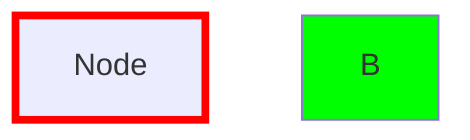
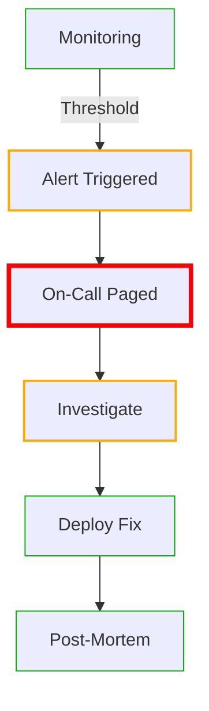

# Phase 2: Per-Element Styling - Executive Summary

## 🎯 Strategic Vision

Enable **rich visual semantics in terminal diagrams** while maintaining **100% Mermaid compatibility**.

## 🏆 Key Innovation

**We parse standard Mermaid style syntax and map it to terminal styles.** Your diagrams work unchanged in GitHub, Mermaid.live, and VSCode, while TermiFlow enhances them in the terminal.

## 💡 Core Insight


- **In Mermaid/GitHub**: Shows thick vs thin borders
- **In TermiFlow**: Maps to heavy `┏━┓` vs normal `┌─┐` borders

## 📊 Mapping Strategy

| Mermaid Style | Terminal Style | Visual Result |
|--------------|----------------|---------------|
| `stroke-width:4px+` | BorderStyle::Heavy | `┏━━━┓` |
| `stroke-width:2-3px` | BorderStyle::Double | `╔═══╗` |
| `rx:5,ry:5` | BorderStyle::Rounded | `╭───╮` |
| `stroke-dasharray` | BorderStyle::Ascii | `+---+` |
| `stroke:#ff0000` | ANSIColor::Red | Red border |

## ✅ What Works Today (Phase 1)

```bash
# Global style for entire diagram
termiflow --style heavy diagram.md
```

## 🚀 What's Coming (Phase 2)

```mermaid
# Different styles per node/edge
graph TD
    Gateway[API Gateway]:::heavy
    Service[Microservice]:::normal
    Database[(PostgreSQL)]:::double
    External[Third Party]:::dashed
```

## 🔒 Compatibility Guarantee

### This Will Always Work



✅ GitHub  
✅ Mermaid.live  
✅ VSCode  
✅ Any Mermaid renderer  
✅ TermiFlow (with enhancements)

### This Will Never Work

```mermaid
graph TD
    A[Node]{style:heavy}     ❌ Breaks Mermaid
    A --[thick]--> B         ❌ Breaks Mermaid
    A[Node|heavy]            ❌ Breaks Mermaid
```

## 📈 Implementation Phases

### Phase 2.1: Border Styles (Next Sprint)
- Parse Mermaid `classDef`, `style`, `:::`
- Map stroke-width to border styles
- Apply per-node rendering

### Phase 2.2: Colors (Following Sprint)
- Parse color properties
- Add ANSI color codes
- Terminal capability detection

### Phase 2.3: Advanced (Future)
- Edge styling via comments
- Background patterns
- Animations (blink, pulse)

## 💼 Business Value

1. **Visual Semantics**: Different node types immediately recognizable
2. **State Communication**: Error states stand out visually
3. **System Boundaries**: Microservices visually grouped
4. **Zero Learning Curve**: Uses standard Mermaid syntax
5. **Risk-Free Adoption**: Diagrams remain portable

## 🎨 Real-World Example



**Terminal Rendering**:
- Critical paths in heavy borders
- Warnings in double borders
- Normal flow in standard borders

## 🔑 Success Metrics

| Metric | Target | Measurement |
|--------|--------|-------------|
| Compatibility | 100% | All diagrams render in Mermaid.live |
| Performance | <10% overhead | Benchmark vs Phase 1 |
| Adoption | >50% power users | Survey after 3 months |
| Breaking Changes | 0 | Test suite coverage |

## 📝 Documentation Delivered

1. **PHASE2_PLAN.md** - Complete architecture (500+ lines)
2. **PHASE2_IMPLEMENTATION.md** - Code examples & patterns
3. **PHASE2_QUICK_REFERENCE.md** - User syntax guide
4. **SPEC.md** - Updated with Phase 2 sections

## ⚡ Action Items

1. **Approve approach** - Mermaid-native syntax mapping
2. **Prioritize Phase 2.1** - Border styles first
3. **Assign resources** - 2-week sprint for Phase 2.1
4. **Review parser architecture** - Ensure extensibility

## 🏁 Conclusion

Phase 2 delivers **powerful visual semantics** while maintaining **zero compatibility risk**. By parsing standard Mermaid syntax and intelligently mapping to terminal capabilities, we enhance developer experience without sacrificing portability.

**The best part?** Users don't need to learn anything new - they just use Mermaid as they always have, and TermiFlow makes it beautiful in the terminal.