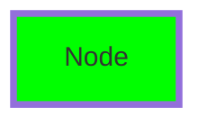

# TermiFlow Technical Specification

## Table of Contents
1. [Parser Specification](#1-parser-specification)
2. [Layout Algorithm](#2-layout-algorithm)
3. [Canvas Rendering](#3-canvas-rendering)
4. [Configuration System](#4-configuration-system)
5. [Style System](#5-style-system)
6. [Error Handling](#6-error-handling)

## 1. Parser Specification

### 1.1 Supported Mermaid Syntax

```mermaid
graph TD    # or TB, LR, BT
    A[Rectangle Node]
    B[(Database Node)]
    A --> B    # Edge
    A --> C --> D    # Edge chain
    click A "file.md"    # Click target
```

### 1.2 Two-Pass Parsing Algorithm

**Pass 1: Node Discovery**
- Scan all lines for node definitions and edge references
- Build index of all node IDs
- Track first reference line number for each node
- Collect node labels from definitions

**Pass 2: Graph Construction**
- Build nodes with labels (auto-create if missing)
- Parse edges and build adjacency
- Parse click targets
- Apply configuration directives

### 1.3 Regular Expressions

| Pattern | Purpose | Regex |
|---------|---------|-------|
| Direction | Graph direction | `graph\s+(TD\|LR\|TB\|BT)` |
| Node | Rectangle node | `([a-zA-Z0-9_]+)\[([^\[\]]*)\]` |
| Database | Database node | `([a-zA-Z0-9_]+)\[\(([^\)]*)\)\]` |
| Edge | Edge/chain | `([a-zA-Z0-9_]+)(?:\[[^\]]*\])?\s*--+>\s*([a-zA-Z0-9_]+)` |
| Click | Click target | `click\s+(\w+)\s+["']([^"']+)["']` |
| Config | In-file directive | `%%\s*termiflow:\s*(\w+)=(\w+)` |

### 1.4 Unsupported Syntax (Generates Warnings)

- Subgraphs: `subgraph X`
- Edge labels: `A -->|text| B`
- Non-rectangular nodes: `A{diamond}`, `A((circle))`
- Mermaid styling: `style A fill:#f00`
- Class definitions: `classDef`

### 1.5 Error Handling

| Severity | Condition | Behavior |
|----------|-----------|----------|
| FATAL | Empty file | Exit with error |
| FATAL | No graph direction | Exit with error |
| WARNING | Unsupported syntax | Skip line, warn (fatal in strict) |
| WARNING | Malformed syntax | Skip line, warn (fatal in strict) |
| INFO | Auto-created node | Create with ID as label |

### 1.6 Forward References

Nodes can be referenced before definition:
```
A --> B    # B not yet defined
B[Label]   # Definition comes later
```

## 2. Layout Algorithm

### 2.1 Waterfall Layout

**Algorithm Steps:**
1. Build adjacency from edges
2. Detect cycles using DFS
3. Mark back-edges
4. Topological sort (Kahn's algorithm)
5. Assign ranks (depths)
6. Position nodes by rank
7. Apply direction-specific transforms

### 2.2 Node Positioning

#### Vertical Layouts (TD/TB/BT)
- Nodes placed horizontally within ranks
- Child nodes centered under parents when possible
- Minimum spacing: `COL_SPACING` (3 chars)

#### Horizontal Layout (LR)
- Nodes placed vertically within ranks  
- Rank columns separated by node width + spacing

#### Bottom-to-Top (BT)
- Y-coordinates flipped after layout

### 2.3 Cycle Handling

- Back-edges detected via DFS
- Marked with `is_back_edge` flag
- Rendered in right gutter with dotted lines
- Warning emitted: "Cycle detected"

### 2.4 Constants

| Constant | Value | Purpose |
|----------|-------|---------|
| BOX_HEIGHT | 3 | Node box height |
| BOX_MIN_WIDTH | 5 | Minimum node width |
| ROW_SPACING | 2 | Vertical gap between ranks |
| COL_SPACING | 3 | Horizontal gap between nodes |
| RIGHT_GUTTER | 4 | Reserved for back-edges |

## 3. Canvas Rendering

### 3.1 Rendering Pipeline

1. Calculate canvas dimensions from layout
2. Create 2D character grid
3. Draw nodes (boxes with labels)
4. Route edges (with junction detection)
5. Place arrows (vertical segments only)
6. Convert grid to string

### 3.2 Edge Routing

**Algorithm:**
```
1. Start from source node bottom center
2. Draw vertical segment down
3. At mid_y, turn horizontal toward target
4. Draw vertical segment to target top
5. Place arrow if vertical segment exists
```

**Mid-Y Calculation:**
- Base: midpoint between source and target
- Offset by edge index for parallel edges
- Clamped to ensure vertical segments

### 3.3 Character Selection Rules

#### Corners
- Down-right: `┐` (source going right)
- Down-left: `┌` (source going left)  
- Up-right: `┘` (target from left)
- Up-left: `└` (target from right)

#### Junctions (Partially Implemented)
- T-down: `┬` (split downward)
- T-up: `┴` (merge upward)
- T-right: `├` (branch right)
- T-left: `┤` (branch left)

#### Arrows
- **Rule**: Only on vertical segments
- Never on horizontal lines
- Must have vertical line above

### 3.4 Canvas Limits

| Limit | Value | Behavior |
|-------|-------|----------|
| MAX_CANVAS_WIDTH | 500 | Clip with warning |
| MAX_CANVAS_HEIGHT | 200 | Clip with warning |

### 3.5 Back-Edge Rendering

- Rendered in right gutter
- Uses dotted line style (`:` or `┆`)
- Horizontal from node to gutter
- Vertical in gutter
- Arrow pointing back to target

## 4. Configuration System

### 4.1 Three-Tier Priority

1. **CLI Flags** (highest priority)
2. **In-file Directives** (`%% termiflow:`)
3. **Config File** (`~/.config/termiflow/config.toml`)

### 4.2 Configuration Options

| Option | CLI Flag | Directive | Config File |
|--------|----------|-----------|-------------|
| Style | `--style` | `style=unicode` | `style = "unicode"` |
| Max Label | `--max-label` | `max_label=20` | `max_label_width = 20` |
| Strict | `--strict` | N/A | N/A |

### 4.3 Config File Format (TOML)

```toml
# ~/.config/termiflow/config.toml
style = "unicode"        # ascii|unicode|double|rounded|heavy
max_label_width = 25
```

### 4.4 In-File Directives

```
graph TD
%% termiflow: style=unicode
%% termiflow: max_label=15
```

## 5. Style System

### 5.1 Border Styles

| Style | Box | Edge | Arrow |
|-------|-----|------|-------|
| ASCII | `+-|` | `-|` | `v^<>` |
| Unicode | `┌┐└┘─│` | `─│` | `▼▲◀▶` |
| Double | `╔╗╚╝═║` | `═║` | `▼▲◀▶` |
| Rounded | `╭╮╰╯─│` | `─│` | `▼▲◀▶` |
| Heavy | `┏┓┗┛━┃` | `━┃` | `▼▲◀▶` |

### 5.2 Style Character Set

Each style defines:
- Box corners (tl, tr, bl, br)
- Box lines (h, v)
- Edge lines (edge_h, edge_v)
- Corners (corner_dr, corner_dl, corner_ur, corner_ul)
- Junctions (junction_down, junction_up, junction_right, junction_left)
- Arrows (arrow_down, arrow_up, arrow_left, arrow_right)
- Back-edge lines (back_h, back_v)
- Cross character

### 5.3 Label Handling

**Width Calculation:**
- Uses Unicode width (`unicode-width` crate)
- Handles CJK and emoji correctly
- Box width = label width + 4 (padding + borders)

**Truncation:**
- Applied when label > max_label_width
- Ellipsis: "..." (3 chars)
- Preserves grapheme clusters

## 6. Error Handling

### 6.1 Error Categories

| Category | Examples | Exit Code |
|----------|----------|-----------|
| Parse Error | Empty file, no direction | 1 |
| Layout Error | Failed topological sort | 1 |
| Render Error | Canvas overflow | 1 |
| Config Error | Invalid TOML | Continue with defaults |

### 6.2 Warning Format

```
termiflow: warning: line {N}: {message}
```

### 6.3 Strict Mode

- Enabled with `--strict` flag
- Warnings become fatal errors
- Exception: Auto-create warnings (always INFO)

### 6.4 Debug Features

| Feature | Flag | Output |
|---------|------|--------|
| Layout Debug | `--debug-layout` | (Not implemented) |

## Implementation Status

### Complete ✅
- Two-pass parser with forward references
- Topological layout with cycle detection  
- Multi-style rendering (5 styles)
- Edge routing with arrows
- Configuration system (3-tier)
- Strict/lenient modes
- Label truncation
- Back-edge detection

### Partial ⚠️
- Junction characters (defined, not fully used)
- Back-edge rendering (works but could be improved)
- Config file loading (implemented, needs testing)

### Not Implemented ❌
- TUI mode (ratatui integration)
- Click targets (parsed, not used)
- Debug-layout flag
- Node shapes beyond rectangles

## Performance Characteristics

| Metric | Value | Notes |
|--------|-------|-------|
| Parse Time | <1ms | 100-node graphs |
| Memory | O(n) | Linear with nodes |
| Regex Compilation | Once | via `lazy_static` |
| Max Tested Size | 1000+ nodes | No issues found |

## Future Enhancements

### Phase 2: Per-Element Styling (PLANNED)

**Goal**: Support Mermaid's native style syntax for terminal rendering

#### Supported Mermaid Syntax


#### Terminal Style Mapping
- `stroke-width:4px+` → Heavy border
- `stroke-width:2-3px` → Double border  
- `rx/ry` → Rounded border
- `stroke:#hex` → ANSI color (nearest match)
- `stroke-dasharray` → ASCII style (future: dashed)

#### Implementation Strategy
1. Parse standard Mermaid style syntax
2. Map to terminal equivalents
3. Maintain 100% Mermaid compatibility
4. Use comments for terminal-only hints

See `PHASE2_PLAN.md` and `PHASE2_IMPLEMENTATION.md` for details.

### Phase 3: Interactive TUI
- Ratatui integration
- Keyboard navigation (vim-style)
- Click target support
- Zoom/pan for large graphs
- Search and filter

### Phase 4: Enterprise Features
- SVG/PNG export with styles
- Large graph optimization (10K+ nodes)
- CI/CD integration
- Diff visualization
- Real-time collaboration