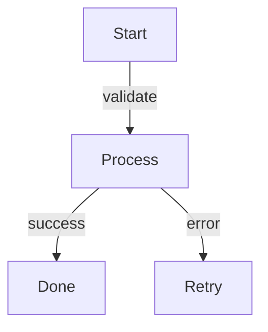
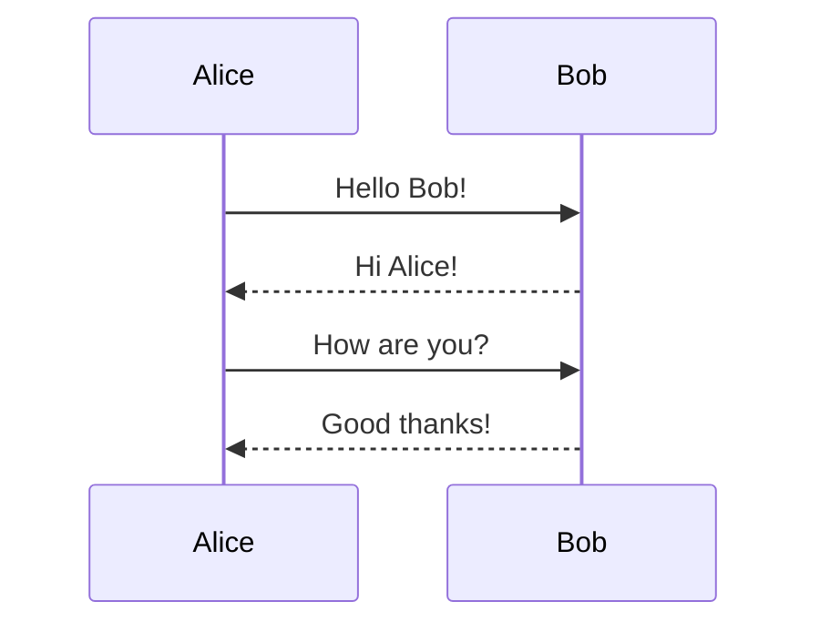
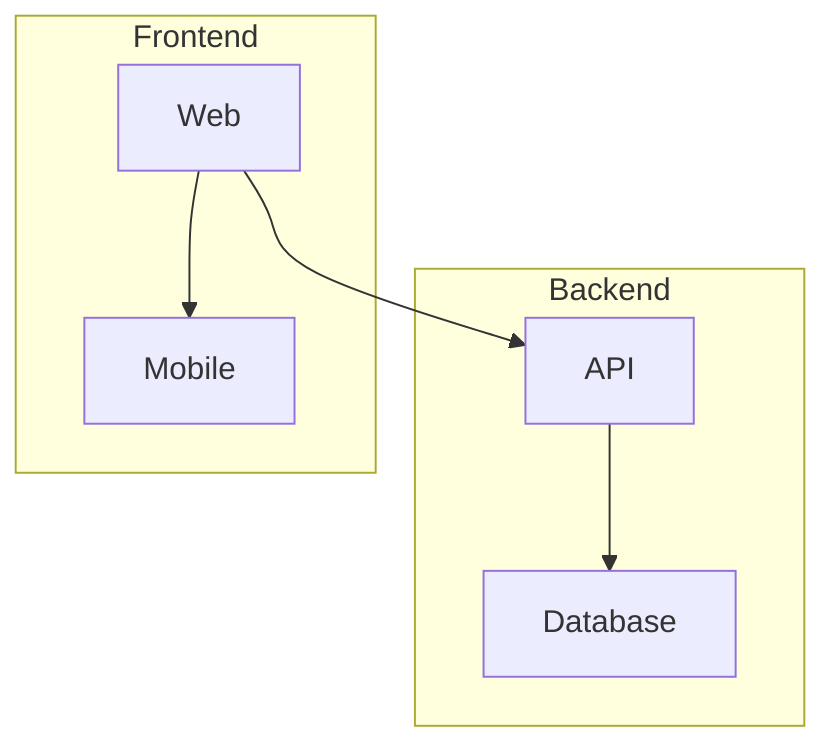
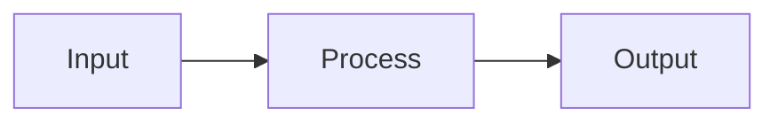
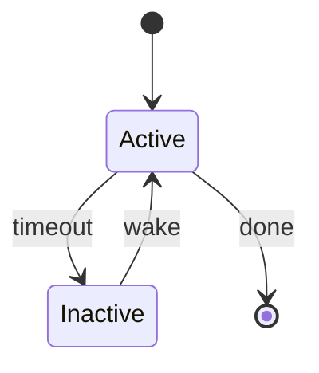
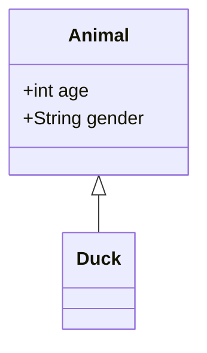
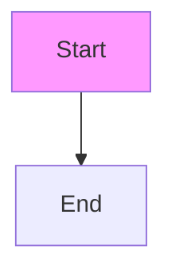

# TermiFlow Strategic Roadmap

> "jq for diagrams" - pipe-friendly, terminal-native Mermaid rendering

## Current State (v0.1.x)

- 9 composite styles (ascii, unicode, heavy, double, rounded, dots, plus, stars, blocks)
- Expanded edge routing with vertical stems and junctions (RFC-001)
- Two-pass parser with forward references
- Waterfall layout with cycle detection
- 9 node shapes (rectangle, rounded, diamond, circle, stadium, hexagon, database, subroutine, asymmetric)
- Edge labels (pipe and text syntax)
- Subgraphs (single-level grouping, enabled by default)
- 135 tests passing

---

## Hackweek Sprint (Priority Focus)

**Goal:** Maximum feature impact - expand diagram capabilities and visual polish.

### H1. Edge Labels ✅ COMPLETE
**Priority:** P0 | **Complexity:** Medium | **Impact:** High

Support `-->|label|` syntax for edge annotations.



**Implementation approach:**
- Parser: Recognize `-->|text|`, `-- text -->`, and styled variants
- Layout: Add label row between connected nodes
- Render: Center label on vertical edge segment

**Acceptance criteria:**
- [x] Parse all Mermaid edge label syntaxes
- [x] Render labels centered on edge paths
- [x] Handle multi-word labels with proper width
- [x] Golden tests for labeled edges

---

### H2. Node Shapes ✅ COMPLETE
**Priority:** P0 | **Complexity:** Medium | **Impact:** High

Support common Mermaid node shapes for visual variety.

| Syntax | Shape | Unicode | ASCII |
|--------|-------|---------|-------|
| `[text]` | Rectangle | `┌─┐ │ └─┘` | `+-+ \| +-+` (current) |
| `(text)` | Rounded | `╭─╮ │ ╰─╯` | `/-\ \| \-/` |
| `{text}` | Diamond | `◇` centered | `/\ \/` |
| `((text))` | Circle | `(  )` | `(  )` |
| `([text])` | Stadium | `(══)` | `(==)` |
| `>text]` | Flag/Asymmetric | `▷──┐` | `>--+` |

**Implementation approach:**
- Parser: Detect shape delimiters, store `NodeShape` enum in Node
- Render: Shape-specific `draw_*()` functions
- Layout: Calculate bounding box per shape type

**Acceptance criteria:**
- [x] Parse all shape syntaxes
- [x] Render each shape in unicode and ascii modes
- [x] Edge connections attach to correct anchor points
- [x] Golden tests for each shape

---

### H3. Sequence Diagrams
**Priority:** P0 | **Complexity:** High | **Impact:** Very High

New diagram type - huge feature expansion.



**Target output (Unicode):**
```
┌───────┐            ┌───────┐
│ Alice │            │  Bob  │
└───┬───┘            └───┬───┘
    │                    │
    │  Hello Bob!        │
    │───────────────────>│
    │                    │
    │  Hi Alice!         │
    │<- - - - - - - - - -│
    │                    │
```

**Target output (ASCII):**
```
+-------+            +-------+
| Alice |            |  Bob  |
+---+---+            +---+---+
    |                    |
    |  Hello Bob!        |
    |------------------>|
    |                    |
    |  Hi Alice!         |
    |<- - - - - - - - - -|
    |                    |
```

**Architecture:**
```
src/
├── parser.rs          (add diagram type detection)
├── diagrams/
│   ├── mod.rs         (DiagramType enum, dispatch)
│   ├── flowchart/     (existing code, reorganized)
│   │   ├── parser.rs
│   │   ├── layout.rs
│   │   └── render.rs
│   └── sequence/      (NEW)
│       ├── parser.rs  (~150 lines)
│       ├── layout.rs  (~100 lines)
│       └── render.rs  (~200 lines)
└── lib.rs             (dispatch based on diagram type)
```

**Parser requirements:**
- Detect `sequenceDiagram` header
- Parse `participant Name` and `actor Name`
- Parse messages: `->>` (solid), `-->>` (dashed), `-x` (lost), `-)` (async)
- Parse message text after `:`

**Layout requirements:**
- Horizontal participant spacing (equal or content-aware)
- Vertical message ordering (time flows down)
- Calculate lifeline column positions

**Render requirements:**
- Participant boxes at top
- Dashed vertical lifelines
- Horizontal arrows with labels
- Arrow heads: `>`, `>>`, `x`, `)`

**Acceptance criteria:**
- [ ] Parse basic sequence diagram syntax
- [ ] Render participants with lifelines
- [ ] Render solid and dashed message arrows
- [ ] Message labels positioned correctly
- [ ] Unicode and ASCII style support
- [ ] Golden tests for sequence diagrams

---

### H4. Subgraphs ✅ COMPLETE
**Priority:** P1 | **Complexity:** High | **Impact:** High

Group nodes visually within flowcharts.



**Target output:**
```
┌─────────────────────┐
│       Backend       │
│  ┌───────┐          │
│  │  API  │          │
│  └───┬───┘          │
│      │              │
│      ↓              │
│  ┌──────────┐       │
│  │ Database │       │
│  └──────────┘       │
└─────────────────────┘
```

**Implementation approach:**
- Parser: Detect `subgraph name ... end` blocks
- Layout: Hierarchical positioning (subgraph as container)
- Render: Outer box with title, inner nodes positioned within

**Challenges:**
- Edge routing across subgraph boundaries ✅ Solved
- Nested subgraphs (deferred - single-level only)
- Subgraph title positioning ✅ Solved

**Acceptance criteria:**
- [x] Parse subgraph syntax
- [x] Render subgraph as containing box
- [x] Position nodes within subgraph bounds
- [x] Route edges across subgraph boundaries (edge-aware borders)
- [x] Golden tests for subgraphs

---

### H5. LR/RL Orientation Polish
**Priority:** P2 | **Complexity:** Medium | **Impact:** Medium

Improve horizontal layout quality.



**Current issues:**
- Edge routing optimized for TD, not LR
- Junction characters assume vertical flow

**Tasks:**
- [ ] Audit layout for orientation assumptions
- [ ] Implement horizontal edge routing
- [ ] Use correct junction chars for horizontal flow (`├`, `┤`, `┬`, `┴`)
- [ ] Golden tests for LR diagrams

---

## Post-Hackweek (Distribution)

These are important but deferred to focus hackweek on features:

### P1. Publish to crates.io
**Priority:** P1 (post-hackweek) | **Complexity:** Low

`cargo install termiflow`

- [ ] Verify Cargo.toml metadata
- [ ] `cargo publish --dry-run`
- [ ] Publish v0.2.0

### P2. GitHub Actions CI/CD
**Priority:** P2 (post-hackweek) | **Complexity:** Medium

- [ ] CI: test on push/PR
- [ ] Release: build binaries on tag
- [ ] Cross-compile: macOS, Linux (x86_64, aarch64)

### P3. Homebrew Tap
**Priority:** P3 (post-hackweek) | **Complexity:** Medium

`brew install dnvt/tap/termiflow`

---

## Future Considerations (v0.4.0+)

### State Diagrams


### Class Diagrams


### Watch Mode
`termiflow --watch diagram.md`

### Per-Element Styling


### Theme Presets
`--theme=github-dark`, `--theme=monokai`

---

## Hackweek Progress Summary

```
✅ H1: Edge Labels - COMPLETE
   └── Parser → Layout → Render → Golden tests

✅ H2: Node Shapes - COMPLETE
   └── 9 shapes with Unicode/ASCII variants

⏳ H3: Sequence Diagrams - NOT STARTED
   └── Major architecture refactor needed

✅ H4: Subgraphs - COMPLETE
   └── Single-level grouping, edge-aware borders, enabled by default
```

**Completed:**
- Flowcharts with labels, shapes, and subgraphs
- 135 tests passing (110 unit + 20 golden + 5 integration)

---

## Architecture Evolution

**Current (flowchart-only):**
```
src/
├── parser.rs      (flowchart parser)
├── layout.rs      (flowchart layout)
├── render/        (flowchart render)
├── graph.rs       (flowchart data)
└── lib.rs         (entry point)
```

**Target (multi-diagram):**
```
src/
├── lib.rs                    (public API, diagram dispatch)
├── main.rs                   (CLI)
├── config.rs                 (configuration)
├── style.rs                  (shared styling)
├── diagrams/
│   ├── mod.rs                (DiagramType enum)
│   ├── flowchart/
│   │   ├── mod.rs
│   │   ├── parser.rs
│   │   ├── graph.rs
│   │   ├── layout.rs
│   │   └── render.rs
│   └── sequence/
│       ├── mod.rs
│       ├── parser.rs
│       ├── model.rs          (Participant, Message)
│       ├── layout.rs
│       └── render.rs
└── render/
    ├── mod.rs                (shared Canvas)
    └── canvas.rs
```

---

*Last updated: December 10, 2024*
*Status: H1, H2, H4 complete. H3 (Sequence Diagrams) pending.*
