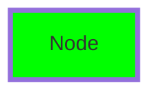

# TermiFlow Technical Specification

## Table of Contents
1. [Parser Specification](#1-parser-specification)
2. [Layout Algorithm](#2-layout-algorithm)
3. [Canvas Rendering](#3-canvas-rendering)
4. [Configuration System](#4-configuration-system)
5. [Style System](#5-style-system)
6. [Error Handling](#6-error-handling)

## 1. Parser Specification

### 1.1 Supported Mermaid Syntax

```mermaid
graph TD    # or TB, LR, BT
    %% termiflow: style=corner:dots,border:heavy
    subgraph SG1 [Core]
        A[Rectangle Node] -->|label| B[(Database Node)]
        A -- text label --> C{Decision}
    end
    C --> D((Circle))
    click A "file.md"    # Click target (parsed; not acted on by CLI yet)
```

### 1.2 Two-Pass Parsing Algorithm

**Pass 1: Node Discovery**
- Scan all lines for node definitions and edge references
- Build index of all node IDs
- Track first reference line number for each node
- Collect node labels from definitions

**Pass 2: Graph Construction**
- Build nodes with labels (auto-create if missing)
- Parse edges and build adjacency
- Parse click targets
- Apply configuration directives

### 1.3 Regular Expressions

| Pattern | Purpose | Regex |
|---------|---------|-------|
| Direction | Graph direction | `graph\s+(TD\|LR\|TB\|BT)` |
| Node | Rectangle node | `([a-zA-Z0-9_]+)\[([^\[\]]*)\]` |
| Database | Database node | `([a-zA-Z0-9_]+)\[\(([^\)]*)\)\]` (conceptually `ID[(label)]`) |
| Edge | Edge/chain | `([a-zA-Z0-9_]+)(?:shape)?\s*--+>\s*([a-zA-Z0-9_]+)` |
| Edge label (pipe) | `A -->|label| B` | `([a-zA-Z0-9_]+)(?:shape)?\s*--+>\s*\|([^|]+)\|\s*([a-zA-Z0-9_]+)` |
| Edge label (text) | `A -- label --> B` | `([a-zA-Z0-9_]+)(?:shape)?\s*--\s+([^-]+?)\s+--+>\s*([a-zA-Z0-9_]+)` |
| Click | Click target | `click\s+(\w+)\s+["']([^"']+)["']` |
| Config | In-file directive | `%%\s*termiflow:\s*(\w+)=([^\s]+)` |
| Subgraph (bracket) | `subgraph ID [Title]` | `^\s*subgraph\s+(\w+)\s*\[([^\]]*)\]` |
| Subgraph (plain) | `subgraph Title` | `^\s*subgraph\s+(.+)$` |
| Subgraph end | `end` | `^\s*end\s*$` |

### 1.4 Unsupported Syntax (Generates Warnings)

- Nested subgraphs: parsed structurally with a warning today; ancestor-aware
  portal and clearance work is in progress, but full hierarchical
  layout/render support remains incomplete:
  `subgraph ... subgraph ... end end`
- Mermaid styling: `style A fill:#f00`
- Class definitions: `classDef`
- Mermaid class usage: `:::`

### 1.5 Error Handling

| Severity | Condition | Behavior |
|----------|-----------|----------|
| FATAL | Empty file | Exit with error |
| FATAL | No graph direction | Exit with error |
| WARNING | Unsupported syntax | Skip line, warn (fatal in strict) |
| WARNING | Malformed syntax | Skip line, warn (fatal in strict) |
| INFO | Auto-created node | Create with ID as label |

### 1.6 Forward References

Nodes can be referenced before definition:
```
A --> B    # B not yet defined
B[Label]   # Definition comes later
```

## 2. Layout Algorithm

### 2.1 Coarse Layout (Default Engine)

**Algorithm Steps:**
1. Build adjacency from edges and detect cycles (mark `is_back_edge`).
2. Assign layers (lenient Kahn) and optimize intra-layer ordering to reduce crossings.
3. Place nodes on a coarse grid using direction-agnostic coordinates (primary/secondary axes).
4. Flip coordinates for BT/RL to match flow direction.
5. Compute subgraph inner/outer envelopes (with title band + gutters).
6. Build an occupancy grid from inflated node rects and subgraph border “rings”.
7. Carve portals into nodes/subgraph borders (optional) to allow clean entry/exit points.
8. Route a subset of forward edges using Manhattan/A* obstacle avoidance.
   - The renderer owns fan-in/fan-out junction aesthetics and cross-subgraph portal piercing, so layout routing may be intentionally partial.

### 2.2 Node Positioning

#### Vertical Layouts (TD/TB/BT)
- Nodes are layered on the primary axis; siblings are placed along the secondary axis.
- Layer-to-layer spacing is increased when needed for labels, fan-in/fan-out, and subgraph boundaries.

#### Horizontal Layout (LR)
- Same algorithm as TD, but with a different primary axis (direction-agnostic).

#### Bottom-to-Top (BT)
- Coordinates are flipped after placement to preserve the same core logic.

### 2.3 Cycle Handling

- Back-edges detected via DFS
- Marked with `is_back_edge` flag
- Rendered in right gutter with dotted lines
- Warning emitted: "Cycle detected"

### 2.4 Constants

| Constant | Value | Purpose |
|----------|-------|---------|
| BOX_HEIGHT | 3 | Node box height |
| BOX_MIN_WIDTH | 5 | Minimum node width |
| ROW_SPACING | 2 | Vertical gap between ranks |
| COL_SPACING | 3 | Horizontal gap between nodes |
| CYCLE_GUTTER | 4 | Reserved for back-edges |
| subgraph_gutter | 2 | Default layout gutter around subgraphs |

## 3. Canvas Rendering

### 3.1 Rendering Pipeline

1. Calculate canvas dimensions from laid-out nodes (and cycle gutter if needed).
2. Create a 2D character grid.
3. Draw subgraph borders/titles (background layer).
4. Optionally carve portal openings in subgraph borders (`TERMIFLOW_DISABLE_PORTALS` disables).
5. Draw edges:
   - Precomputed routes (from layout) when present.
   - Convergent edges (N→1).
   - Divergent edges (1→N), including cross-subgraph edges with portal-aware border piercing.
   - Back-edges via the cycle gutter router.
6. Draw labels on routed segments.
7. Draw node boxes + labels.
8. Reinforce portal piercings (so crossings read clearly) and convert grid to string.

### 3.2 Edge Routing

Edge routing is direction-agnostic via `OrientedCoords`:
- **Divergent edges (1→N)**: stem → junction span → drops → arrows
- **Convergent edges (N→1)**: stems → shared junction → arrow
- **Cross-subgraph edges**: portal-aware border piercing to avoid corrupting container borders/titles
- **Back-edges**: routed through a dedicated gutter to avoid cluttering the main diagram

### 3.3 Character Selection Rules

#### Corners
- Down-right: `┐` (source going right)
- Down-left: `┌` (source going left)  
- Up-right: `┘` (target from left)
- Up-left: `└` (target from right)

#### Junctions
- T-down: `┬` (split downward)
- T-up: `┴` (merge upward)
- T-right: `├` (branch right)
- T-left: `┤` (branch left)

#### Arrows
- Arrows are placed at the end of the routed edge, aligned to the diagram direction.
- Arrows are treated as endpoints and are not overwritten during overlap resolution.

### 3.4 Canvas Limits

| Limit | Value | Behavior |
|-------|-------|----------|
| MAX_CANVAS_WIDTH | 500 | Clip with warning |
| MAX_CANVAS_HEIGHT | 200 | Clip with warning |

### 3.5 Back-Edge Rendering

- Rendered in right gutter
- Uses dotted line style (`:` or `┆`)
- Horizontal from node to gutter
- Vertical in gutter
- Arrow pointing back to target

## 4. Configuration System

### 4.1 Three-Tier Priority

1. **CLI Flags** (highest priority)
2. **In-file Directives** (`%% termiflow:`)
3. **Config File** (`~/.config/termiflow/config.toml`)

### 4.2 Configuration Options

| Option | CLI Flag | Directive | Config File |
|--------|----------|-----------|-------------|
| Style | `--style` | `style=unicode` | `style = "unicode"` |
| Max Label | `--max-label` | `max_label=20` | `max_label_width = 20` |
| Strict | `--strict` | N/A | N/A |

### 4.3 Config File Format (TOML)

```toml
# ~/.config/termiflow/config.toml
style = "unicode"        # ascii|unicode|double|rounded|heavy
max_label_width = 25
```

### 4.4 In-File Directives

```
graph TD
%% termiflow: style=unicode
%% termiflow: max_label=15
```

## 5. Style System

### 5.1 Border Styles

| Style | Box | Edge | Arrow |
|-------|-----|------|-------|
| ascii | `+-|` | `-|` | `v^<>` |
| unicode | `┌┐└┘─│` | `─│` | `↓↑←→` |
| double | `╔╗╚╝═║` | `═║` | `▼▲◀▶` |
| rounded | `╭╮╰╯─│` | `─│` | `↓↑←→` |
| heavy | `┏┓┗┛━┃` | `━┃` | `▼▲◀▶` |
| dots | `....` | `:` | `v^<>` |
| plus | `++++` | `+` | `v^<>` |
| stars | `****` | `*` | `v^<>` |
| blocks | `████` | `█` | `v^<>` |

### 5.2 Style Character Set

Each style defines:
- Box corners (tl, tr, bl, br)
- Box lines (h, v)
- Edge lines (edge_h, edge_v)
- Corners (corner_dr, corner_dl, corner_ur, corner_ul)
- Junctions (junction_down, junction_up, junction_right, junction_left)
- Arrows (arrow_down, arrow_up, arrow_left, arrow_right)
- Back-edge lines (back_h, back_v)
- Cross character

### 5.3 Label Handling

**Width Calculation:**
- Uses Unicode width (`unicode-width` crate)
- Handles CJK and emoji correctly
- Box width = label width + 4 (padding + borders)

**Truncation:**
- Applied when label > max_label_width
- Ellipsis: "..." (3 chars)
- Preserves grapheme clusters

### 5.4 Composite Styling

Composite styles mix components in a single `--style` string:

```
corner:dots,border:heavy,arrow:unicode,subgraph:ascii
```

Supported components: `corner`, `border`, `arrow`, `edge`, `junction`, `back`, `subgraph`.

## 6. Error Handling

### 6.1 Error Categories

| Category | Examples | Exit Code |
|----------|----------|-----------|
| Parse Error | Empty file, no direction | 1 |
| Layout Error | Failed topological sort | 1 |
| Render Error | Canvas overflow | 1 |
| Config Error | Invalid TOML | Continue with defaults |

### 6.2 Warning Format

```
termiflow: warning: line {N}: {message}
```

### 6.3 Strict Mode

- Enabled with `--strict` flag
- Warnings become fatal errors
- Exception: Auto-create warnings (always INFO)

### 6.4 Debug Features

| Feature | Flag | Output |
|---------|------|--------|
| Layout Debug | `--debug-layout` | Node coordinates + edge metadata to stderr |

## Implementation Status

### Complete ✅
- Two-pass parser with forward references
- Coarse layout + hybrid routing (layout + renderer-owned fan-in/fan-out)
- Multi-style rendering (9 styles) + composite styles
- Edge routing across TD/LR/BT/RL
- Configuration system (3-tier)
- Strict/lenient modes
- Label truncation
- Back-edge detection
- Subgraphs (single-level) with portal-aware crossings

### Partial ⚠️
- Click targets (parsed; not acted on by CLI/TUI)

### Not Implemented ❌
- TUI mode (ratatui integration)
- Mermaid styling/classes (`style`, `classDef`, `:::`)

## Performance Characteristics

| Metric | Value | Notes |
|--------|-------|-------|
| Parse Time | <1ms | 100-node graphs |
| Memory | O(n) | Linear with nodes |
| Regex Compilation | Once | via `lazy_static` |
| Max Tested Size | 1000+ nodes | No issues found |

## Future Enhancements

### Phase 2: Per-Element Styling (PLANNED)

**Goal**: Support Mermaid's native style syntax for terminal rendering

#### Supported Mermaid Syntax


#### Terminal Style Mapping
- `stroke-width:4px+` → Heavy border
- `stroke-width:2-3px` → Double border  
- `rx/ry` → Rounded border
- `stroke:#hex` → ANSI color (nearest match)
- `stroke-dasharray` → ASCII style (future: dashed)

#### Implementation Strategy
1. Parse standard Mermaid style syntax
2. Map to terminal equivalents
3. Maintain 100% Mermaid compatibility
4. Use comments for terminal-only hints

See `PHASE2_PLAN.md` and `PHASE2_IMPLEMENTATION.md` for details.

### Phase 3: Interactive TUI
- Ratatui integration
- Keyboard navigation (vim-style)
- Click target support
- Zoom/pan for large graphs
- Search and filter

### Phase 4: Enterprise Features
- SVG/PNG export with styles
- Large graph optimization (10K+ nodes)
- CI/CD integration
- Diff visualization
- Real-time collaboration
